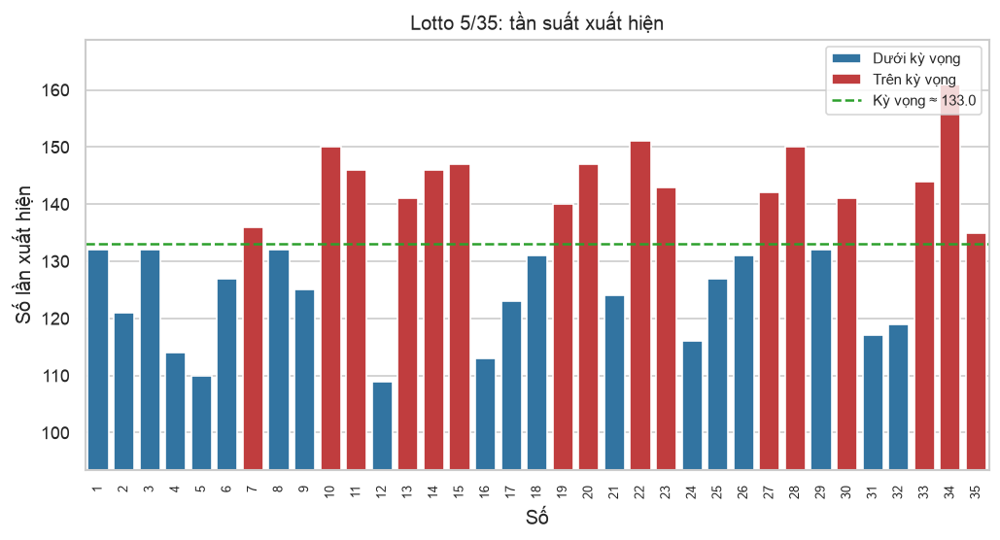
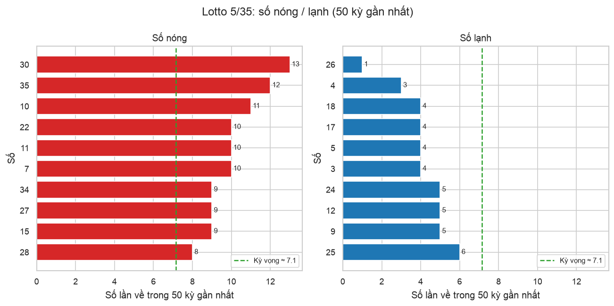
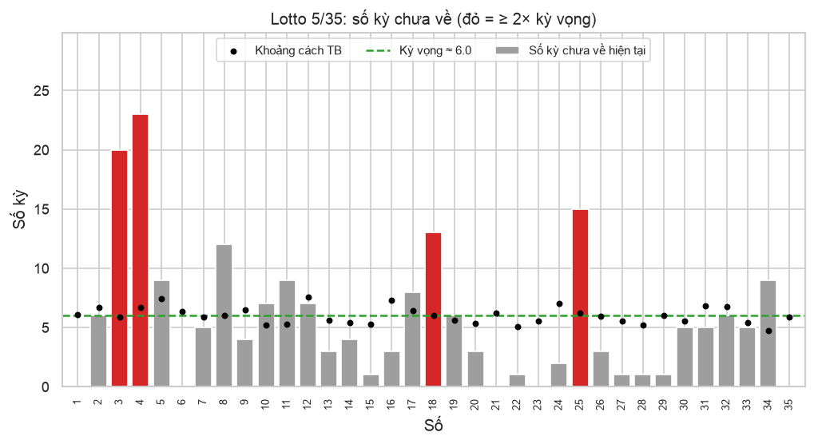
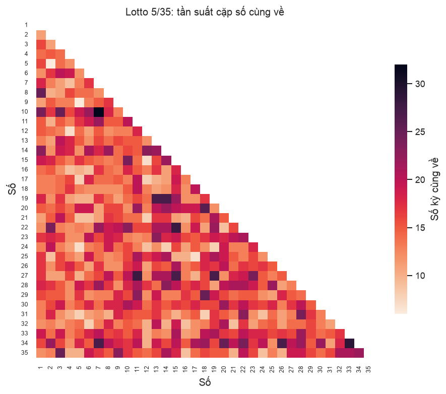
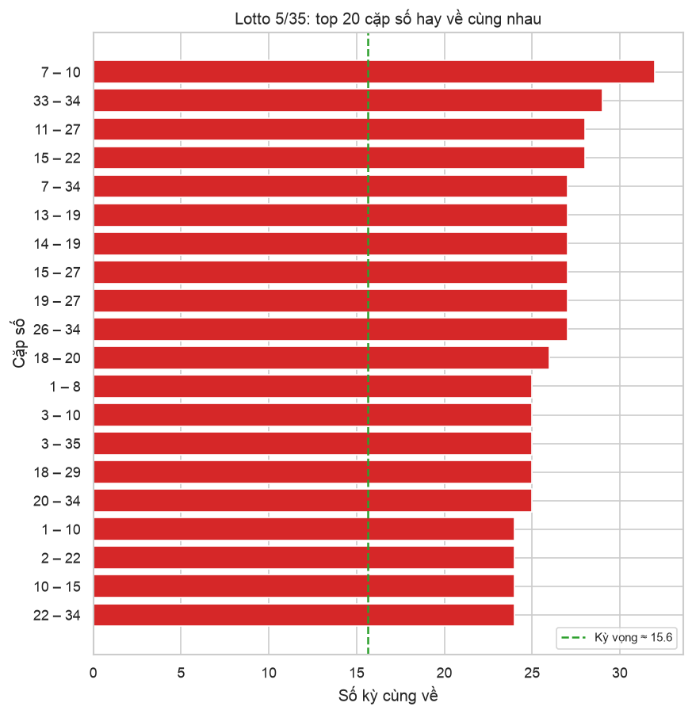
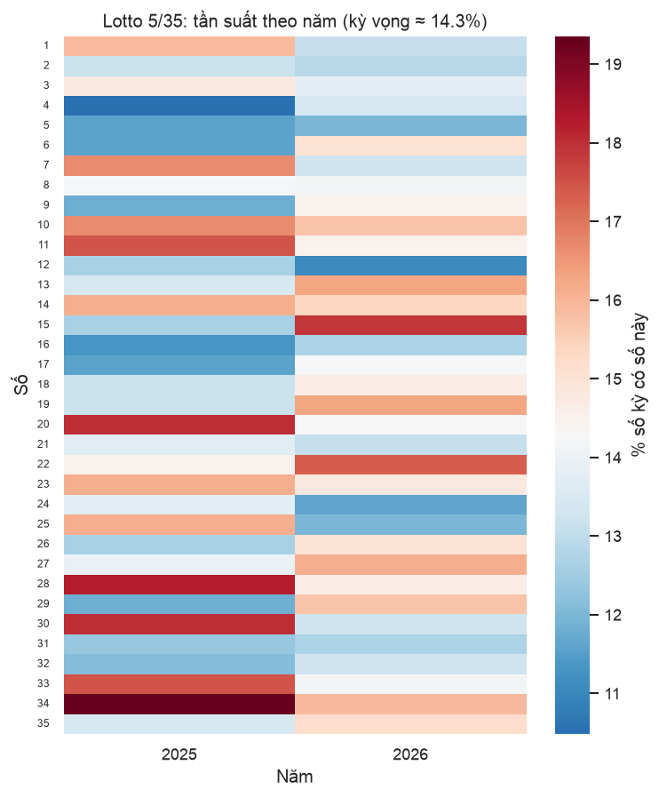
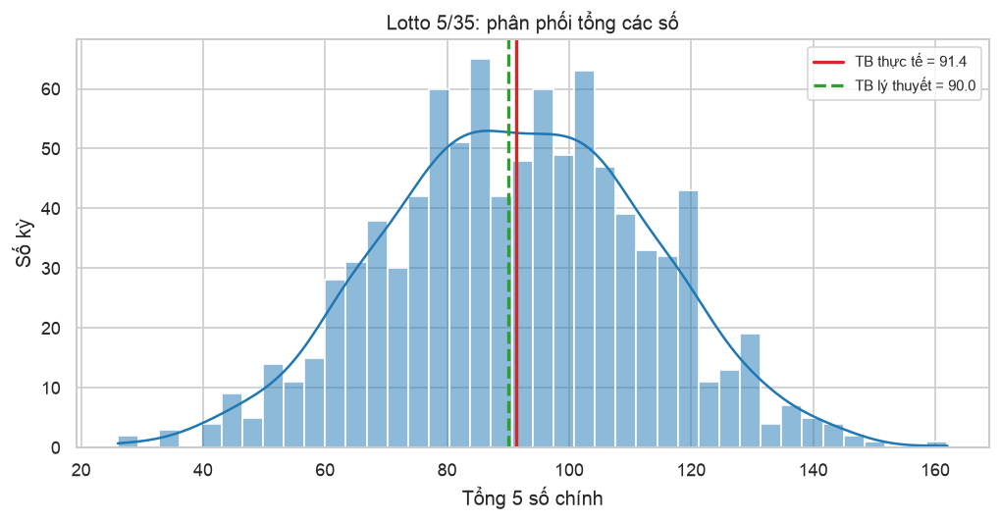
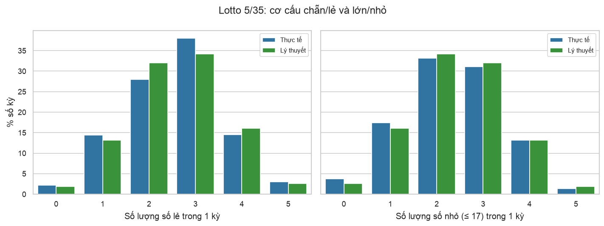
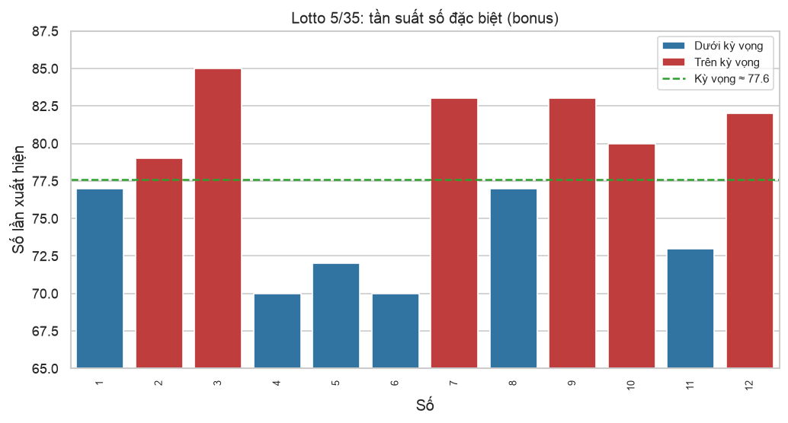

# Báo cáo thống kê Lotto 5/35

_Cập nhật 07/10/2026 14:36 · 931 kỳ, từ kỳ #00001 (29/06/2025) đến kỳ #00931 (07/10/2026)_

> [!WARNING]
> Mỗi kỳ quay là ngẫu nhiên và độc lập. Các số liệu dưới đây chỉ mô tả quá khứ, **không** làm tăng khả năng trúng ở kỳ sau.

## Tổng quan

| Kỳ mới nhất | Ngày | Bộ số | Bonus |
|---|---|---|---|
| #00931 | 07/10/2026 | `01` `06` `21` `23` `35` | `07` |

- Làm sạch dữ liệu: giữ **931/931** dòng, loại 0.
- Kiểm định chi-square tính phân phối đều: χ² = 51.0 (df = 34), p-value = **0.031** → p < 0.05: tần suất lệch khỏi phân phối đều có ý nghĩa thống kê.

## 1. Tần suất xuất hiện

| # | Về nhiều nhất | Số lần | % kỳ | Về ít nhất | Số lần | % kỳ |
|---|---|---|---|---|---|---|
| 1 | `34` | 161 | 17.3% | `12` | 109 | 11.7% |
| 2 | `22` | 151 | 16.2% | `05` | 110 | 11.8% |
| 3 | `10` | 150 | 16.1% | `16` | 113 | 12.1% |
| 4 | `28` | 150 | 16.1% | `04` | 114 | 12.2% |
| 5 | `15` | 147 | 15.8% | `24` | 116 | 12.5% |
| 6 | `20` | 147 | 15.8% | `31` | 117 | 12.6% |
| 7 | `11` | 146 | 15.7% | `32` | 119 | 12.8% |
| 8 | `14` | 146 | 15.7% | `02` | 121 | 13.0% |
| 9 | `33` | 144 | 15.5% | `17` | 123 | 13.2% |
| 10 | `23` | 143 | 15.4% | `21` | 124 | 13.3% |

Kỳ vọng mỗi số ≈ **133.0** lần. [Bản tương tác (HTML)](frequency.html)

## 2. Số nóng / lạnh (50 kỳ gần nhất)

- 🔥 **Nóng**: `30` `35` `10` `07` `11` `22` `15` `27` `34` `28`
- ❄️ **Lạnh**: `26` `04` `03` `05` `17` `18` `09` `12` `24` `25`
- Kỳ vọng mỗi số về ≈ 7.1 lần trong 50 kỳ.

## 3. Số lâu chưa về

| Số | Số kỳ chưa về | Lần về gần nhất | Khoảng cách TB | Khoảng cách dài nhất |
|---|---|---|---|---|
| `04` | 23 | #00908 (25/09/2026) | 6.7 | 36 |
| `03` | 20 | #00911 (27/09/2026) | 5.9 | 29 |
| `25` | 15 | #00916 (29/09/2026) | 6.3 | 35 |
| `18` | 13 | #00918 (30/09/2026) | 6.0 | 60 |
| `08` | 12 | #00919 (01/10/2026) | 6.0 | 31 |
| `05` | 9 | #00922 (02/10/2026) | 7.4 | 42 |
| `11` | 9 | #00922 (02/10/2026) | 5.3 | 33 |
| `34` | 9 | #00922 (02/10/2026) | 4.7 | 31 |
| `17` | 8 | #00923 (03/10/2026) | 6.4 | 33 |
| `10` | 7 | #00924 (03/10/2026) | 5.2 | 23 |

Khoảng cách kỳ vọng ≈ **6.0** kỳ.

## 4. Cặp số hay về cùng nhau

Kỳ vọng mỗi cặp ≈ **15.6** kỳ. [Heatmap tương tác (HTML)](pair_heatmap.html)

**Top 10 bộ ba số hay về cùng nhau:**

| # | Bộ ba | Số kỳ |
|---|---|---|
| 1 | `01` `03` `10` | 8 |
| 2 | `13` `14` `19` | 8 |
| 3 | `08` `14` `35` | 7 |
| 4 | `12` `14` `25` | 6 |
| 5 | `05` `20` `30` | 6 |
| 6 | `18` `20` `30` | 6 |
| 7 | `28` `32` `35` | 6 |
| 8 | `18` `20` `29` | 6 |
| 9 | `08` `17` `20` | 6 |
| 10 | `21` `28` `33` | 6 |

## 5. Tần suất theo năm

## 6. Tổng các số

|  | Trung bình | Độ lệch chuẩn | Min | Max |
|---|---|---|---|---|
| Thực tế | 91.4 | 21.5 | 26 | 162 |
| Lý thuyết | 90.0 | 21.2 |  |  |

## 7. Chẵn/lẻ, lớn/nhỏ

## 8. Số đặc biệt (bonus)

- Về nhiều nhất: `03` `07` `09` `12` `10`
- Về ít nhất: `04` `06` `05` `11` `01`
