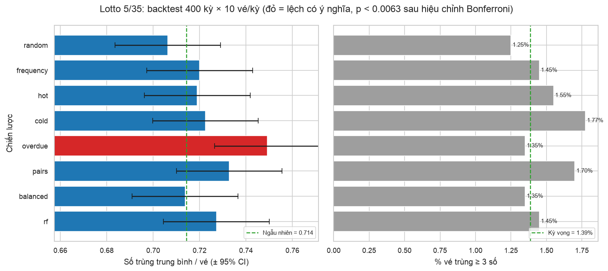
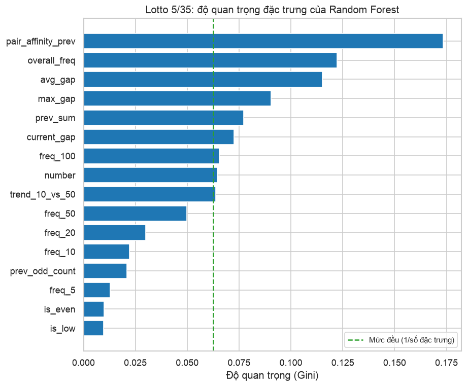

# Backtest chiến lược chọn số Lotto 5/35

_Cập nhật 08/10/2026 09:23 · 400 kỳ (#00532 → #00931) · 10 vé/kỳ/chiến lược · cửa sổ nóng/lạnh 50 kỳ_

> [!WARNING]
> Mỗi vé chỉ được sinh từ dữ liệu **trước** kỳ đó (không nhìn trước kết quả). Nếu một chiến lược thực sự có lợi thế, số trùng trung bình phải cao hơn rõ rệt so với chọn ngẫu nhiên.

## Chiến lược

| Tên | Mô tả |
|---|---|
| `random` | Ngẫu nhiên đều (mốc so sánh) |
| `frequency` | Trọng số theo tần suất toàn bộ lịch sử |
| `hot` | Ưu tiên số về nhiều trong N kỳ gần nhất |
| `cold` | Ưu tiên số về ít trong N kỳ gần nhất |
| `overdue` | Ưu tiên số lâu chưa về |
| `pairs` | Chọn dần theo cặp số hay về cùng nhau |
| `balanced` | Ngẫu nhiên, lọc tổng và chẵn/lẻ ở mức điển hình |
| `rf` | Random Forest (đặc trưng: độ trễ, tần suất trượt, cặp số, kỳ trước) |

## Kết quả

| Chiến lược | Số vé | Trùng TB | p-value | Trùng 0 | Trùng 1 | Trùng 2 | Trùng 3 | Trùng 4 | Trùng 5 | Trúng bonus |
|---|---|---|---|---|---|---|---|---|---|---|
| `random` | 4000 | 0.706 | 0.489 | 1766 | 1696 | 488 | 47 | 3 | 0 | 327 |
| `frequency` | 4000 | 0.720 | 0.623 | 1778 | 1624 | 540 | 56 | 2 | 0 | 300 |
| `hot` | 4000 | 0.719 | 0.685 | 1742 | 1705 | 491 | 59 | 3 | 0 | 316 |
| `cold` | 4000 | 0.723 | 0.480 | 1756 | 1671 | 502 | 69 | 2 | 0 | 333 |
| `overdue` | 4000 | 0.749 | 0.003 | 1647 | 1767 | 532 | 50 | 4 | 0 | 312 |
| `pairs` | 4000 | 0.733 | 0.112 | 1731 | 1677 | 524 | 66 | 2 | 0 | 328 |
| `balanced` | 4000 | 0.714 | 0.963 | 1763 | 1674 | 509 | 53 | 1 | 0 | 325 |
| `rf` | 4000 | 0.727 | 0.265 | 1728 | 1698 | 516 | 53 | 5 | 0 | 316 |
| _kỳ vọng (ngẫu nhiên)_ | 4000 | 0.714 |  | 1755.9 | 1688.4 | 500.3 | 53.6 | 1.8 | 0.0 | 333.3 |

## Kết luận

- Chiến lược có số trùng TB cao nhất: `overdue` (0.749 so với 0.714 của chọn ngẫu nhiên), p-value = 0.003.
- Vì so sánh 8 chiến lược cùng lúc, ngưỡng có ý nghĩa sau hiệu chỉnh Bonferroni là p < 0.0063. Có 1 chiến lược vượt ngưỡng: `overdue`. Nên chạy lại với `--seed` khác và nhiều kỳ hơn trước khi tin vào kết quả này.

## Random Forest: đánh giá ngoài mẫu

Huấn luyện trên 24,990 mẫu đầu, kiểm tra trên 6,545 mẫu cuối (tỉ lệ số về = 0.143).

- **AUC = 0.5071** (đoán mò = 0.5, độ lệch chuẩn khi không có tín hiệu ≈ 0.0102, tức z = +0.70). Mô hình không phân biệt được số nào sẽ về tốt hơn đoán mò.
- Độ quan trọng của đặc trưng chỉ cho biết cây dùng đặc trưng nào để chia nhánh, **không** chứng minh đặc trưng đó có sức dự báo (khi AUC ≈ 0.5, đó chỉ là khớp nhiễu).

