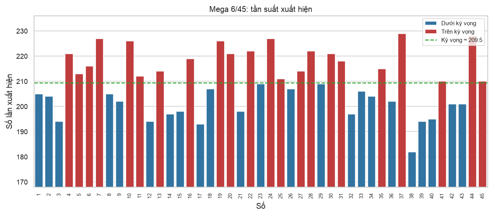
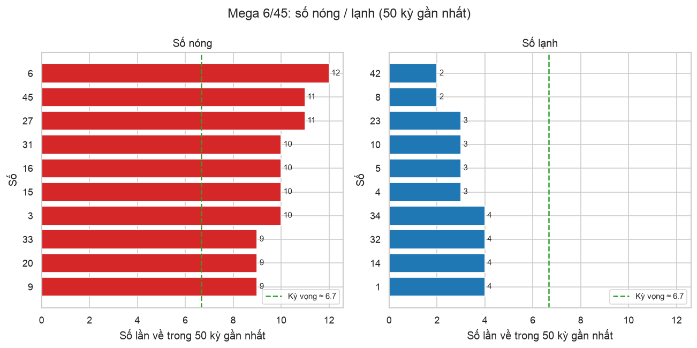
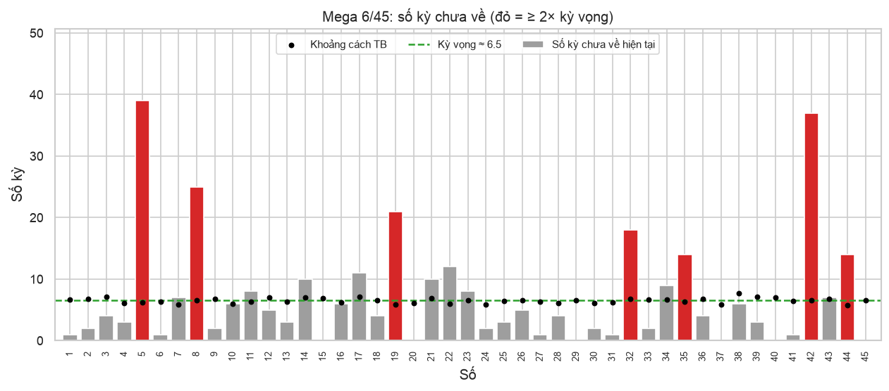
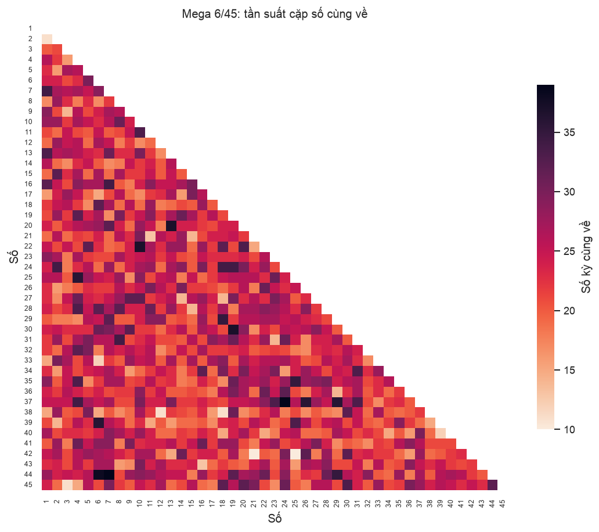
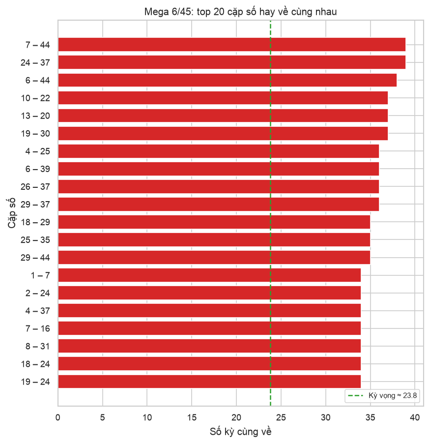
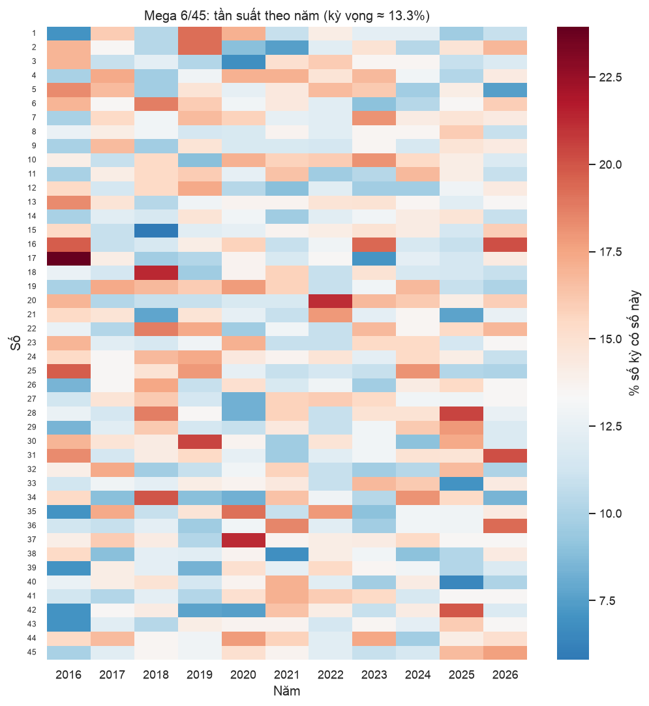
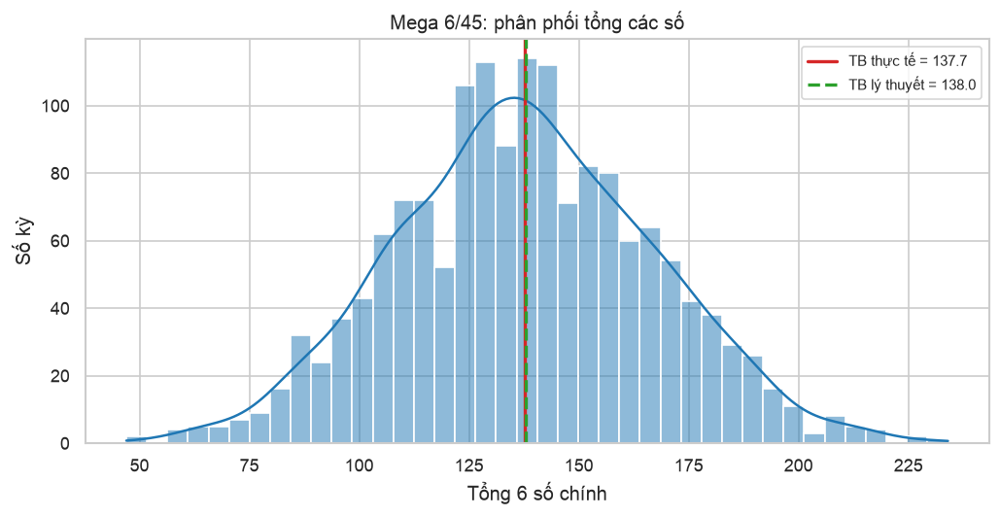
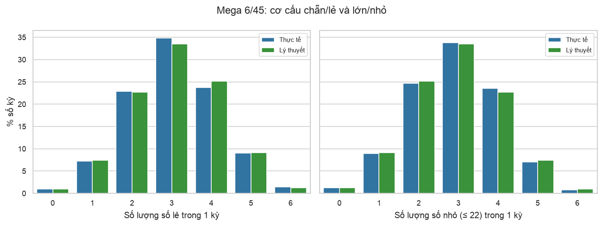

# Báo cáo thống kê Mega 6/45

_Cập nhật 07/10/2026 14:34 · 1,571 kỳ, từ kỳ #00001 (20/07/2016) đến kỳ #01571 (04/10/2026)_

> [!WARNING]
> Mỗi kỳ quay là ngẫu nhiên và độc lập. Các số liệu dưới đây chỉ mô tả quá khứ, **không** làm tăng khả năng trúng ở kỳ sau.

## Tổng quan

| Kỳ mới nhất | Ngày | Bộ số |
|---|---|---|
| #01571 | 04/10/2026 | `15` `20` `29` `37` `40` `45` |

- Làm sạch dữ liệu: giữ **1571/1571** dòng, loại 0.
- Kiểm định chi-square tính phân phối đều: χ² = 31.3 (df = 44), p-value = **0.925** → p ≥ 0.05: không đủ bằng chứng cho thấy có số nào được ưu tiên, tần suất phù hợp với quay ngẫu nhiên đều.

## 1. Tần suất xuất hiện

| # | Về nhiều nhất | Số lần | % kỳ | Về ít nhất | Số lần | % kỳ |
|---|---|---|---|---|---|---|
| 1 | `37` | 229 | 14.6% | `38` | 182 | 11.6% |
| 2 | `44` | 228 | 14.5% | `17` | 193 | 12.3% |
| 3 | `07` | 227 | 14.4% | `03` | 194 | 12.3% |
| 4 | `24` | 227 | 14.4% | `12` | 194 | 12.3% |
| 5 | `10` | 226 | 14.4% | `39` | 194 | 12.3% |
| 6 | `19` | 226 | 14.4% | `40` | 195 | 12.4% |
| 7 | `22` | 222 | 14.1% | `14` | 197 | 12.5% |
| 8 | `28` | 222 | 14.1% | `32` | 197 | 12.5% |
| 9 | `04` | 221 | 14.1% | `15` | 198 | 12.6% |
| 10 | `20` | 221 | 14.1% | `21` | 198 | 12.6% |

Kỳ vọng mỗi số ≈ **209.5** lần. [Bản tương tác (HTML)](frequency.html)

## 2. Số nóng / lạnh (50 kỳ gần nhất)

- 🔥 **Nóng**: `06` `27` `45` `03` `15` `16` `31` `09` `20` `33`
- ❄️ **Lạnh**: `08` `42` `04` `05` `10` `23` `01` `14` `32` `34`
- Kỳ vọng mỗi số về ≈ 6.7 lần trong 50 kỳ.

## 3. Số lâu chưa về

| Số | Số kỳ chưa về | Lần về gần nhất | Khoảng cách TB | Khoảng cách dài nhất |
|---|---|---|---|---|
| `05` | 39 | #01532 (05/07/2026) | 6.2 | 39 |
| `42` | 37 | #01534 (10/07/2026) | 6.5 | 46 |
| `08` | 25 | #01546 (07/08/2026) | 6.6 | 37 |
| `19` | 21 | #01550 (16/08/2026) | 5.9 | 35 |
| `32` | 18 | #01553 (23/08/2026) | 6.8 | 33 |
| `35` | 14 | #01557 (02/09/2026) | 6.3 | 44 |
| `44` | 14 | #01557 (02/09/2026) | 5.8 | 37 |
| `22` | 12 | #01559 (06/09/2026) | 6.0 | 33 |
| `17` | 11 | #01560 (09/09/2026) | 7.1 | 41 |
| `14` | 10 | #01561 (11/09/2026) | 7.0 | 47 |

Khoảng cách kỳ vọng ≈ **6.5** kỳ.

## 4. Cặp số hay về cùng nhau

Kỳ vọng mỗi cặp ≈ **23.8** kỳ. [Heatmap tương tác (HTML)](pair_heatmap.html)

**Top 10 bộ ba số hay về cùng nhau:**

| # | Bộ ba | Số kỳ |
|---|---|---|
| 1 | `10` `22` `36` | 10 |
| 2 | `01` `07` `16` | 10 |
| 3 | `04` `25` `39` | 10 |
| 4 | `10` `13` `22` | 9 |
| 5 | `24` `29` `37` | 9 |
| 6 | `11` `26` `28` | 9 |
| 7 | `10` `22` `43` | 9 |
| 8 | `09` `14` `41` | 9 |
| 9 | `04` `25` `35` | 8 |
| 10 | `17` `21` `40` | 8 |

## 5. Tần suất theo năm

## 6. Tổng các số

|  | Trung bình | Độ lệch chuẩn | Min | Max |
|---|---|---|---|---|
| Thực tế | 137.7 | 29.4 | 47 | 234 |
| Lý thuyết | 138.0 | 29.9 |  |  |

## 7. Chẵn/lẻ, lớn/nhỏ

