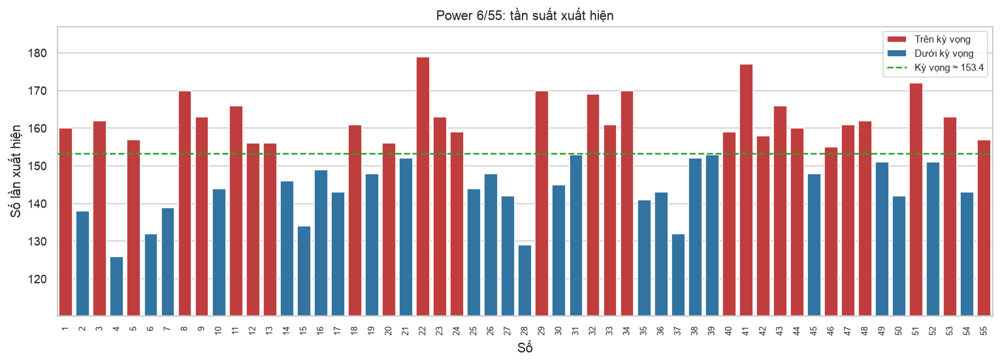
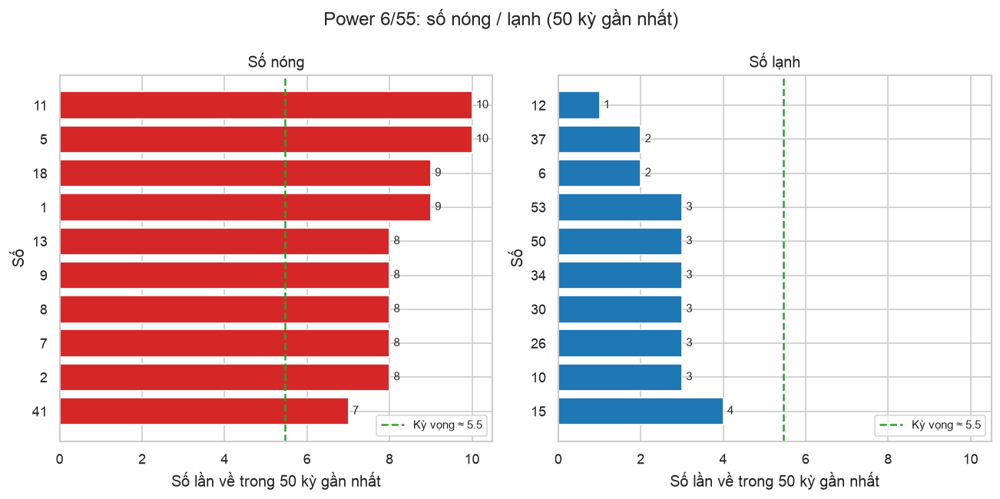
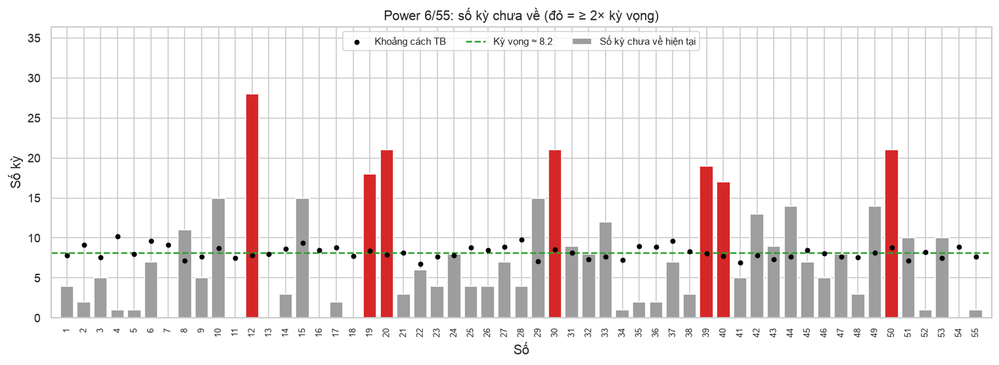
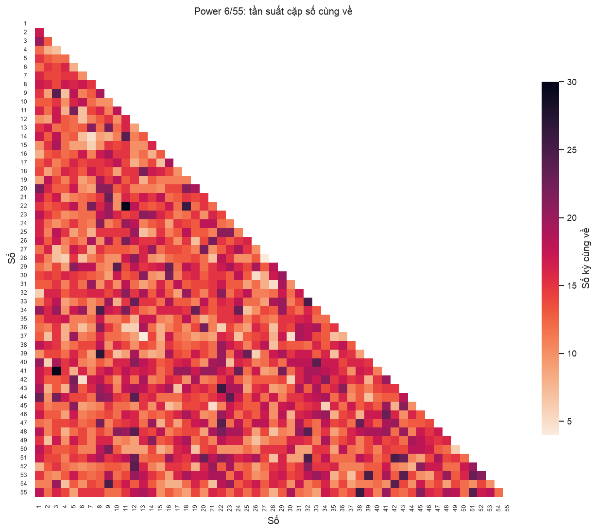
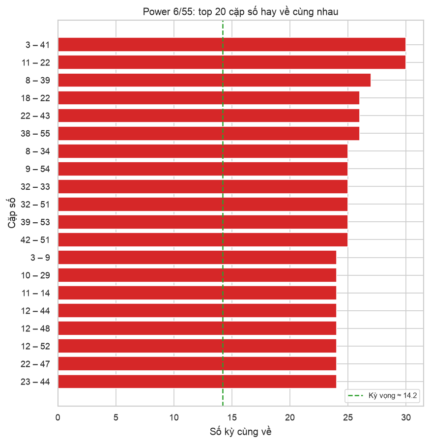
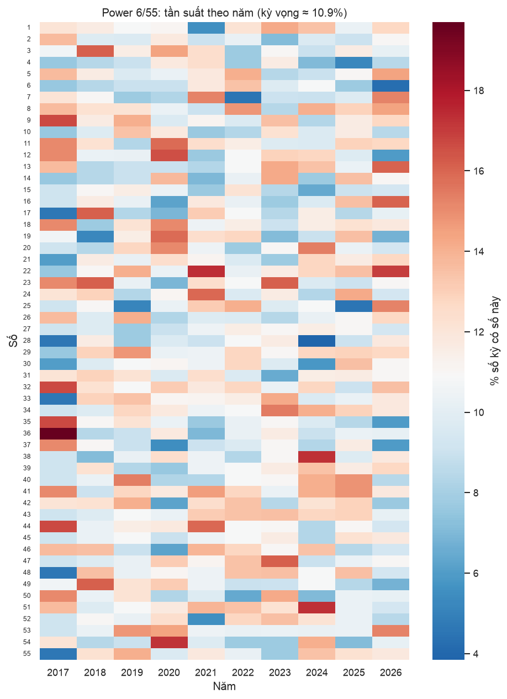
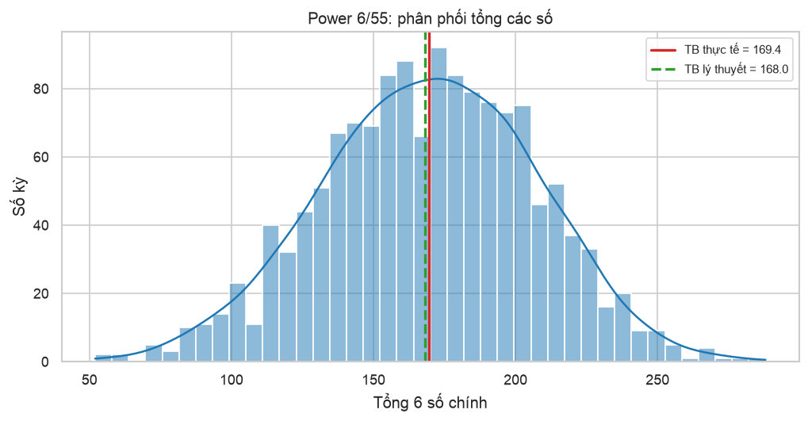
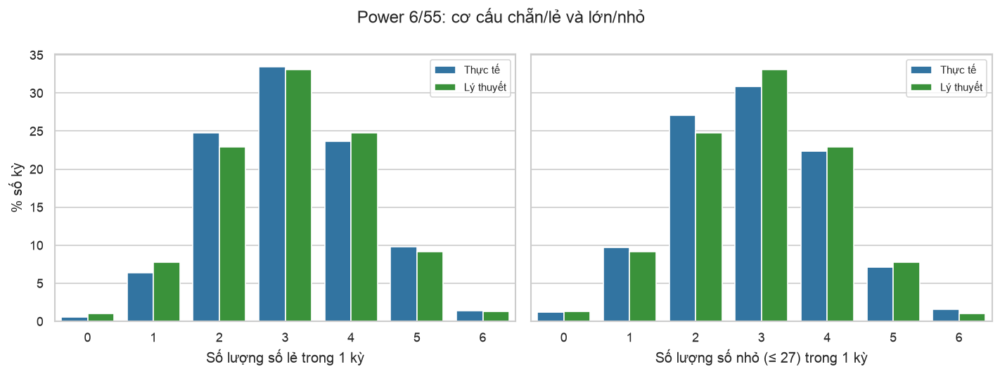
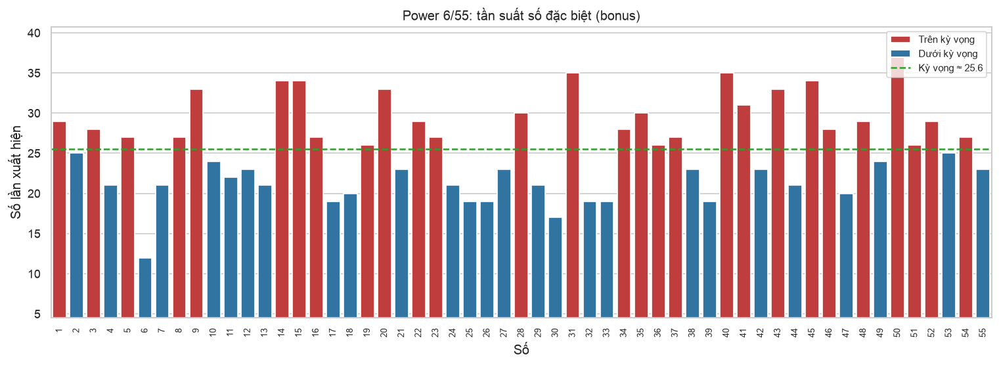

# Báo cáo thống kê Power 6/55

_Cập nhật 07/10/2026 14:34 · 1,406 kỳ, từ kỳ #00001 (01/08/2017) đến kỳ #01406 (03/10/2026)_

> [!WARNING]
> Mỗi kỳ quay là ngẫu nhiên và độc lập. Các số liệu dưới đây chỉ mô tả quá khứ, **không** làm tăng khả năng trúng ở kỳ sau.

## Tổng quan

| Kỳ mới nhất | Ngày | Bộ số | Bonus |
|---|---|---|---|
| #01406 | 03/10/2026 | `07` `11` `13` `16` `18` `54` | `41` |

- Làm sạch dữ liệu: giữ **1406/1406** dòng, loại 0.
- Kiểm định chi-square tính phân phối đều: χ² = 57.5 (df = 54), p-value = **0.345** → p ≥ 0.05: không đủ bằng chứng cho thấy có số nào được ưu tiên, tần suất phù hợp với quay ngẫu nhiên đều.

## 1. Tần suất xuất hiện

| # | Về nhiều nhất | Số lần | % kỳ | Về ít nhất | Số lần | % kỳ |
|---|---|---|---|---|---|---|
| 1 | `22` | 179 | 12.7% | `04` | 126 | 9.0% |
| 2 | `41` | 177 | 12.6% | `28` | 129 | 9.2% |
| 3 | `51` | 172 | 12.2% | `06` | 132 | 9.4% |
| 4 | `08` | 170 | 12.1% | `37` | 132 | 9.4% |
| 5 | `29` | 170 | 12.1% | `15` | 134 | 9.5% |
| 6 | `34` | 170 | 12.1% | `02` | 138 | 9.8% |
| 7 | `32` | 169 | 12.0% | `07` | 139 | 9.9% |
| 8 | `11` | 166 | 11.8% | `35` | 141 | 10.0% |
| 9 | `43` | 166 | 11.8% | `27` | 142 | 10.1% |
| 10 | `09` | 163 | 11.6% | `50` | 142 | 10.1% |

Kỳ vọng mỗi số ≈ **153.4** lần. [Bản tương tác (HTML)](frequency.html)

## 2. Số nóng / lạnh (50 kỳ gần nhất)

- 🔥 **Nóng**: `05` `11` `01` `18` `02` `07` `08` `09` `13` `41`
- ❄️ **Lạnh**: `12` `06` `37` `10` `26` `30` `34` `50` `53` `15`
- Kỳ vọng mỗi số về ≈ 5.5 lần trong 50 kỳ.

## 3. Số lâu chưa về

| Số | Số kỳ chưa về | Lần về gần nhất | Khoảng cách TB | Khoảng cách dài nhất |
|---|---|---|---|---|
| `12` | 28 | #01378 (30/07/2026) | 7.8 | 33 |
| `20` | 21 | #01385 (15/08/2026) | 7.9 | 47 |
| `30` | 21 | #01385 (15/08/2026) | 8.6 | 35 |
| `50` | 21 | #01385 (15/08/2026) | 8.8 | 53 |
| `39` | 19 | #01387 (20/08/2026) | 8.1 | 56 |
| `19` | 18 | #01388 (22/08/2026) | 8.4 | 48 |
| `40` | 17 | #01389 (25/08/2026) | 7.8 | 68 |
| `10` | 15 | #01391 (29/08/2026) | 8.7 | 38 |
| `15` | 15 | #01391 (29/08/2026) | 9.4 | 42 |
| `29` | 15 | #01391 (29/08/2026) | 7.1 | 67 |

Khoảng cách kỳ vọng ≈ **8.2** kỳ.

## 4. Cặp số hay về cùng nhau

Kỳ vọng mỗi cặp ≈ **14.2** kỳ. [Heatmap tương tác (HTML)](pair_heatmap.html)

**Top 10 bộ ba số hay về cùng nhau:**

| # | Bộ ba | Số kỳ |
|---|---|---|
| 1 | `11` `22` `28` | 7 |
| 2 | `08` `36` `39` | 7 |
| 3 | `21` `29` `41` | 7 |
| 4 | `08` `19` `46` | 7 |
| 5 | `10` `29` `34` | 7 |
| 6 | `12` `33` `40` | 7 |
| 7 | `12` `43` `51` | 6 |
| 8 | `34` `40` `49` | 6 |
| 9 | `12` `51` `52` | 6 |
| 10 | `12` `33` `44` | 6 |

## 5. Tần suất theo năm

## 6. Tổng các số

|  | Trung bình | Độ lệch chuẩn | Min | Max |
|---|---|---|---|---|
| Thực tế | 169.4 | 37.4 | 52 | 288 |
| Lý thuyết | 168.0 | 37.0 |  |  |

## 7. Chẵn/lẻ, lớn/nhỏ

## 8. Số đặc biệt (bonus)

- Về nhiều nhất: `50` `31` `40` `14` `15`
- Về ít nhất: `06` `30` `17` `25` `26`
