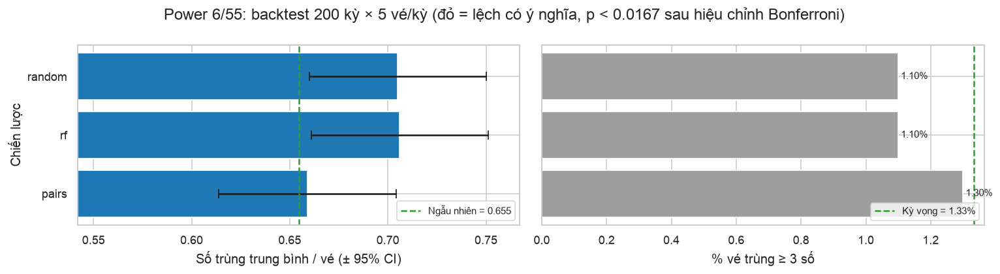
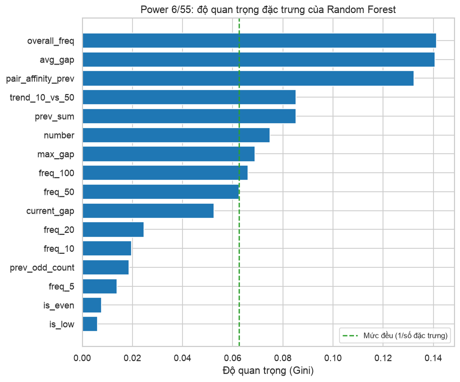

# Backtest chiến lược chọn số Power 6/55

_Cập nhật 08/10/2026 09:15 · 200 kỳ (#01207 → #01406) · 5 vé/kỳ/chiến lược · cửa sổ nóng/lạnh 50 kỳ_

> [!WARNING]
> Mỗi vé chỉ được sinh từ dữ liệu **trước** kỳ đó (không nhìn trước kết quả). Nếu một chiến lược thực sự có lợi thế, số trùng trung bình phải cao hơn rõ rệt so với chọn ngẫu nhiên.

## Chiến lược

| Tên | Mô tả |
|---|---|
| `random` | Ngẫu nhiên đều (mốc so sánh) |
| `pairs` | Chọn dần theo cặp số hay về cùng nhau |
| `rf` | Random Forest (đặc trưng: độ trễ, tần suất trượt, cặp số, kỳ trước) |

## Kết quả

| Chiến lược | Số vé | Trùng TB | p-value | Trùng 0 | Trùng 1 | Trùng 2 | Trùng 3 | Trùng 4 | Trùng 5 | Trùng 6 |
|---|---|---|---|---|---|---|---|---|---|---|
| `random` | 1000 | 0.705 | 0.028 | 432 | 442 | 115 | 11 | 0 | 0 | 0 |
| `rf` | 1000 | 0.706 | 0.025 | 438 | 429 | 122 | 11 | 0 | 0 | 0 |
| `pairs` | 1000 | 0.659 | 0.846 | 470 | 414 | 103 | 13 | 0 | 0 | 0 |
| _kỳ vọng (ngẫu nhiên)_ | 1000 | 0.655 |  | 482.4 | 394.7 | 109.6 | 12.7 | 0.6 | 0.0 | 0.0 |

## Kết luận

- Chiến lược có số trùng TB cao nhất: `rf` (0.706 so với 0.655 của chọn ngẫu nhiên), p-value = 0.025.
- Vì so sánh 3 chiến lược cùng lúc, ngưỡng có ý nghĩa sau hiệu chỉnh Bonferroni là p < 0.0167. **Không chiến lược nào** vượt ngưỡng, nên chênh lệch quan sát được chỉ là dao động ngẫu nhiên.

## Random Forest: đánh giá ngoài mẫu

Huấn luyện trên 60,170 mẫu đầu, kiểm tra trên 15,510 mẫu cuối (tỉ lệ số về = 0.109).

- **AUC = 0.4907** (đoán mò = 0.5, độ lệch chuẩn khi không có tín hiệu ≈ 0.0074, tức z = -1.26). Mô hình không phân biệt được số nào sẽ về tốt hơn đoán mò.
- Độ quan trọng của đặc trưng chỉ cho biết cây dùng đặc trưng nào để chia nhánh, **không** chứng minh đặc trưng đó có sức dự báo (khi AUC ≈ 0.5, đó chỉ là khớp nhiễu).

